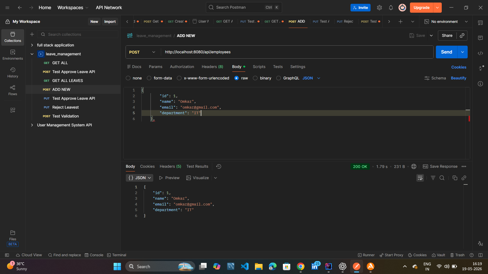
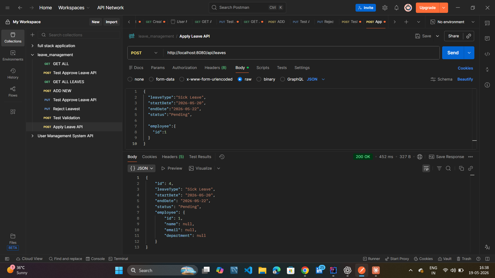
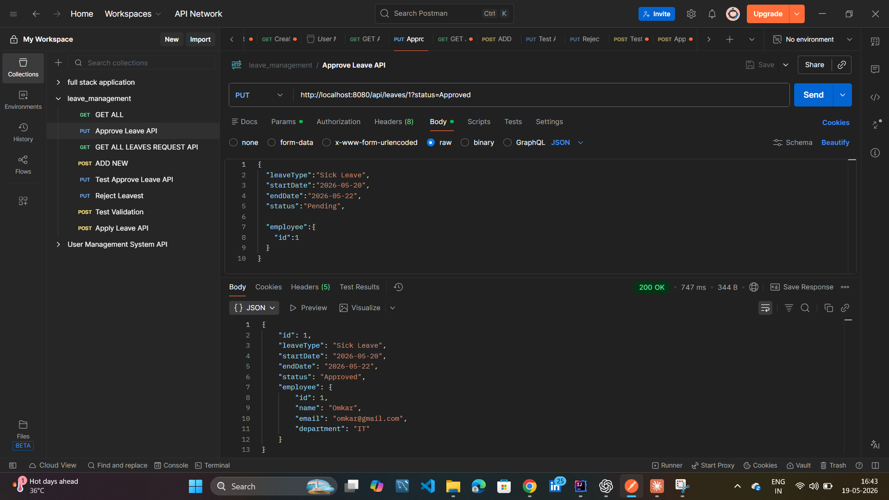
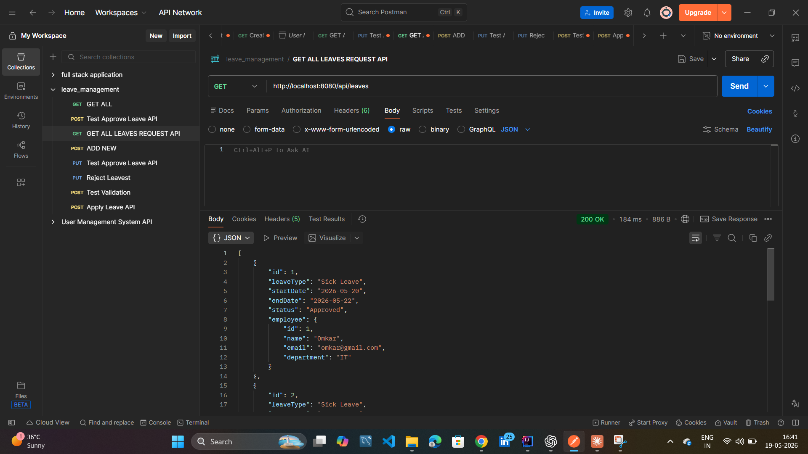
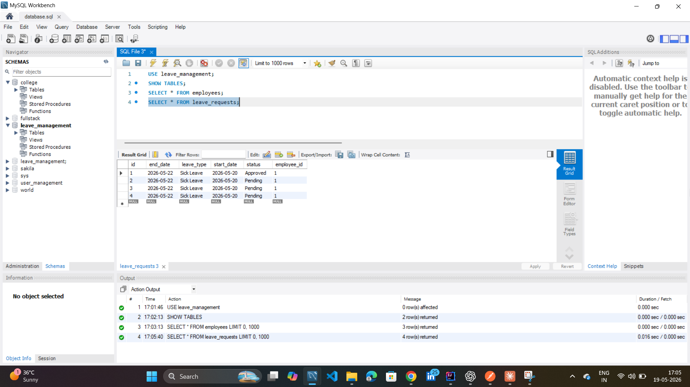
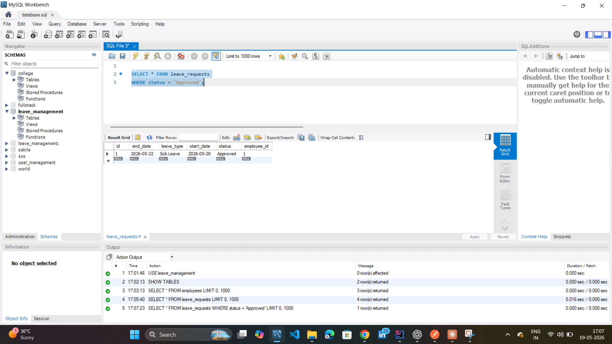
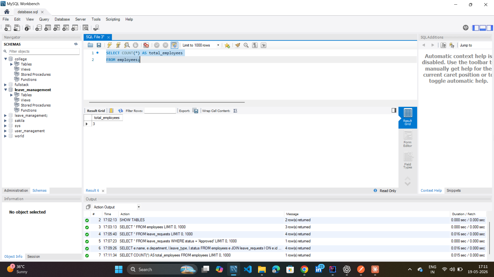

# Employee Leave Management System 

A Spring Boot backend project for managing employees and leave requests using REST APIs, MySQL, and layered architecture.

---

## Features

- Add Employee
- Get All Employees
- Apply Leave
- Approve Leave
- Validation Handling
- Global Exception Handling
- MySQL Database Integration
- REST API Development

---

## Technologies Used

- Java
- Spring Boot
- Spring Data JPA
- MySQL
- Maven
- Postman
- Git & GitHub

---

## Project Architecture

Controller → Service → Repository → Database

---

## API Endpoints

### Employee APIs

| Method | Endpoint | Description |
|--------|-----------|-------------|
| POST | /api/employees | Add Employee |
| GET | /api/employees | Get All Employees |

---

### Leave APIs

| Method | Endpoint | Description |
|--------|-----------|-------------|
| POST | /api/leaves | Apply Leave |
| GET | /api/leaves | Get All Leave Requests |
| PUT | /api/leaves/{id}?status=Approved | Approve Leave |

---

## Validation Example

The project uses validation annotations like:

- @NotBlank
- @Email

Example validation response:

```json
{
  "email": "Invalid email format",
  "name": "Name is required"
}
````

---

## Database Tables

* employees
* leave_requests

---

# API Screenshots

## Create Employee API



---

## Get Employees API


---

## Apply Leave API



---

## Approve Leave API



---

## Validation Test API


---

## Get All Leave Requests API



---

# MySQL Screenshots

## Employee Records


---

## Leave Requests Table



---

## Approved Leaves Query



---

## Employee Leave Relationship Query


---

## Employee Count Query



---

# Author

## Omkar Sutar

* Java Developer
* Spring Boot Backend Developer
* Passionate About Backend Development

```
```
