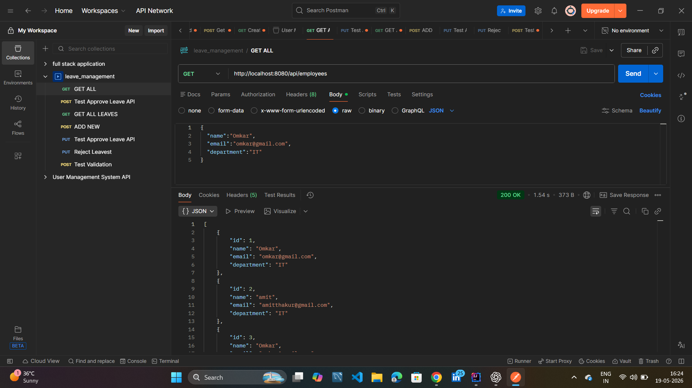
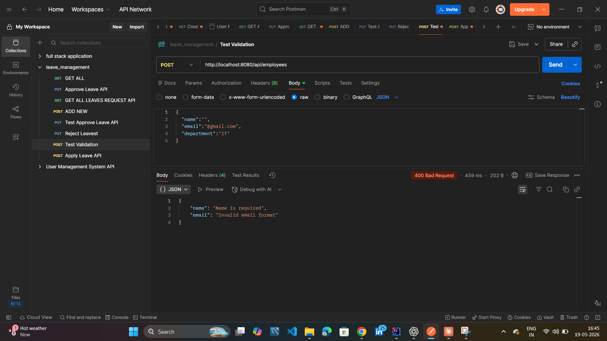
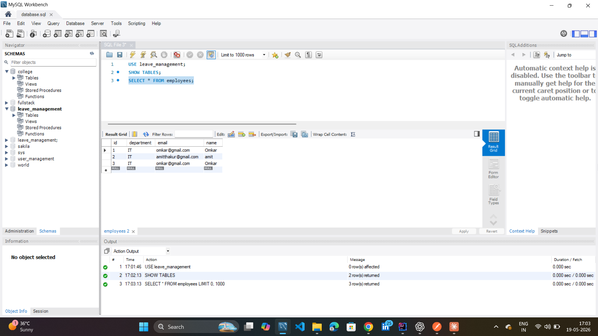
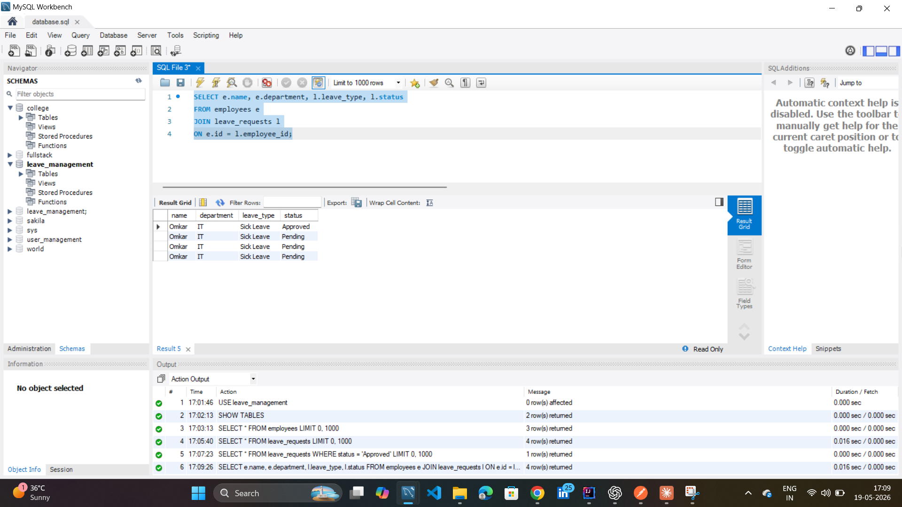

# employee-leave-management-system
Spring Boot backend project for employee leave management with REST APIs, MySQL integration, validation, exception handling, and layered architecture.

# Employee Leave Management System

A backend REST API application developed using Java, Spring Boot, and MySQL for managing employees and leave requests. This project demonstrates CRUD operations, validation, exception handling, layered architecture, and database integration.

---

## Features

- Add Employee
- View All Employees
- Apply Leave Request
- View Leave Requests
- Approve Leave Requests
- Validation Handling
- Global Exception Handling
- MySQL Database Integration
- RESTful APIs

---

## Technologies Used

- Java
- Spring Boot
- Spring Data JPA
- MySQL
- Maven
- Postman
- Git & GitHub

---

## Project Architecture

Controller → Service → Repository → Database

---

## API Endpoints

### Employee APIs

| Method | Endpoint | Description |
|--------|----------|-------------|
| POST | /api/employees | Add Employee |
| GET | /api/employees | Get All Employees |

---

### Leave APIs

| Method | Endpoint | Description |
|--------|----------|-------------|
| POST | /api/leaves | Apply Leave |
| GET | /api/leaves | Get All Leave Requests |
| PUT | /api/leaves/{id}?status=Approved | Approve Leave Request |

---

## Tools Used

- IntelliJ IDEA
- MySQL Workbench
- Postman

---

## API Screenshots

### Create Employee API

---

### Get Employees API

---

### Apply Leave API

---

### Approve Leave API

---

### Validation Test API

---

### Employee Records MySQL

---

### Leave Requests MySQL

---

### Employee Leave Relationship Query

---

## Author

Omkar Sutar
